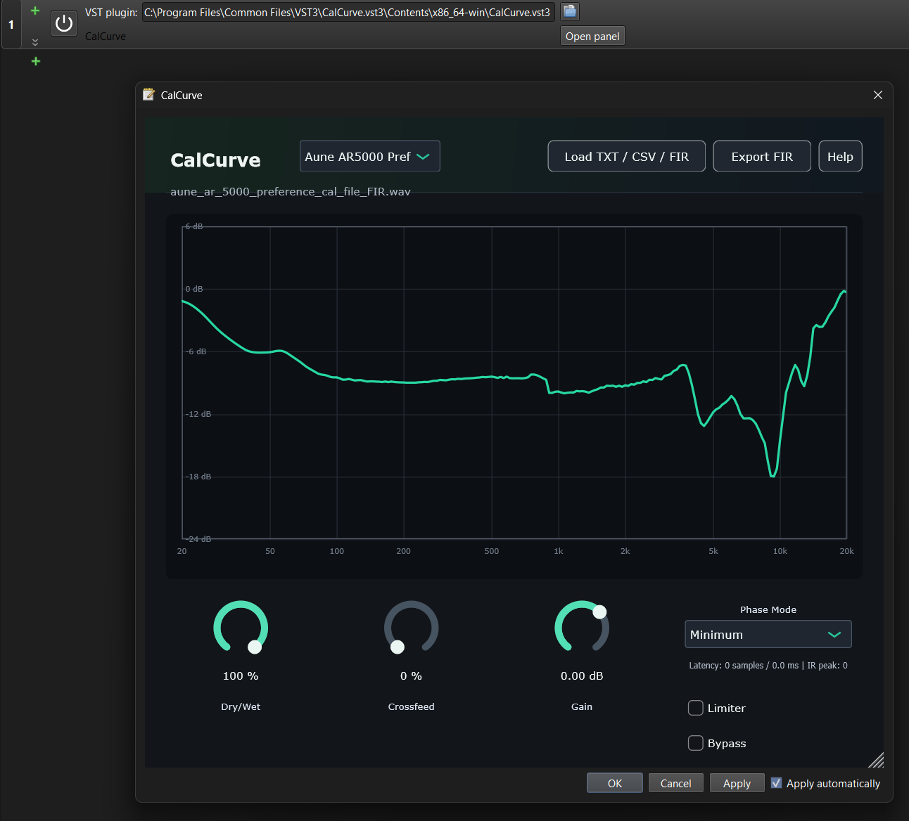

# Equalizer APO 64 with VST3 support

> [!WARNING]
>
> I’m currently reviewing ways to improve the installer’s safety and recovery process, including the possibility of automatically creating a system restore point before installation. This comes after receiving a report from a user who experienced issues with their Windows installation and had to perform a system repair afterward.
>
> The installer was tested on **Windows 11 Version 24H2 (OS Build 26100.4652)** and worked correctly in my testing environment. I have not personally encountered any problems—otherwise I would not have shared the installer. However, Windows configurations, drivers, installed software, and custom system modifications can vary significantly, so compatibility cannot be guaranteed across all setups.
>
> Please proceed with caution. If possible, test the installer first in a virtual machine or on a non-critical system. I’ll also be adding the relevant warnings and recommendations here and on GitHub.

This repository is a restructured Windows fork based on [TheFireKahuna/equalizerAPO64](https://github.com/TheFireKahuna/equalizerAPO64), with the goal of keeping the familiar Equalizer APO workflow while adding
native VST3 plug-in support.



Featured VST3: [CalCurve by Mixomo](https://github.com/Mixomo/CalCurve) 

NOTE: This build was compiled for Windows 10/11 64 bits with AVX2 support only (More compatible with all CPUs). If you need AVX512 support, you'll need a compatible CPU and will have to compile it yourself from this repository. 

## Main Features

- Double procession processing (64 bit internal pipeline) for precision and quality when applying multiple overlapping effects. Examples include convolution, complex parametric EQ setups or GraphicEQ's. 
- Native VST3 hosting through the Steinberg VST3 SDK.
- Existing VST2 support retained for older plug-ins.
- Configuration Editor workflow preserved.
- Reproducible installer build using local dependencies under `third_party/`.
- NSIS-based installer packaging for end users.

## Current VST3 Status

Like VST2, VST3 support is not universal, and there is no guarantee that it will work with all VST3 effects plugins on the market.
It is best to use it with simple, lightweight plugins, as some more complex ones may expose or require parameters that the APO pipeline does not expose or support. 

## About VST3 Plug-ins

VST3 plug-ins can be distributed either as a single `.vst3` file or as a bundle
directory ending in `.vst3`. On Windows, many VST3 plug-ins store their actual
binary under a path similar to:

```text
PluginName.vst3/Contents/x86_64-win/PluginName.vst3
```

If a plug-in does not show its editor, does not animate, process the audio with artifacts or crashes when opened or removed, test it first in a standard VST3 host or DAW. Some plug-ins require host features that Equalizer APO does not provide.

## Installation

### Option A - Install From GitHub Releases

For normal users, install from the latest GitHub Release:

1. Download the x64 installer
2. Run the installer.
3. Choose the playback or capture devices that should use Equalizer APO.
4. Reboot Windows if the installer or Device Selector asks for it.
5. Open Configuration Editor and add filters as usual.
6. To use a plug-in, add a VST plug-in filter and select either a VST2 `.dll`
   or a VST3 `.vst3` bundle.

### Option B - Install From The `Setup` Directory

Also the generated installer is located here:

```text
Setup/EqualizerAPO-x64-1.4.2.exe
```

## Building

The build is designed to be reproducible from the repository root. Third-party
dependencies are installed locally under `third_party/`, so a global Qt or NSIS
installation is not required.

### Build Requirements

- Windows 10 or Windows 11 x64.
- Visual Studio 2022 with the Desktop development with C++ workload.
- A compatible Windows SDK installed through Visual Studio.
- PowerShell 5 or newer.
- Git.
- CMake.
- Internet access for the first dependency bootstrap.

### One-command Installer Build

From the repository root:

```powershell
.\scripts\build-installer-x64.ps1 -Configuration Release
```

The script performs the complete packaging flow:

- Bootstraps local dependencies into `third_party/`.
- Builds the Equalizer APO x64 projects.
- Builds Qt-based applications such as Configuration Editor and Device Selector.
- Deploys the required Qt runtime files with `windeployqt`.
- Stages runtime files under `Setup/lib64`.
- Creates the final NSIS installer under `Setup/`.

## License Summary

- Equalizer APO is distributed under the GNU General Public License. This fork is
  intended to be distributed under GPLv3-or-later where permitted by the original
  upstream licensing terms.
- Keep the original Equalizer APO copyright and license notices when
  redistributing binaries or source code.
- Steinberg VST3 SDK: used for VST3 hosting. License under MIT terms at `third_party/vst3sdk`.
- Microsoft MSVC / Visual Studio C++ toolchain: https://microsoft.com/
- C++ language created by Bjarne Stroustrup.

